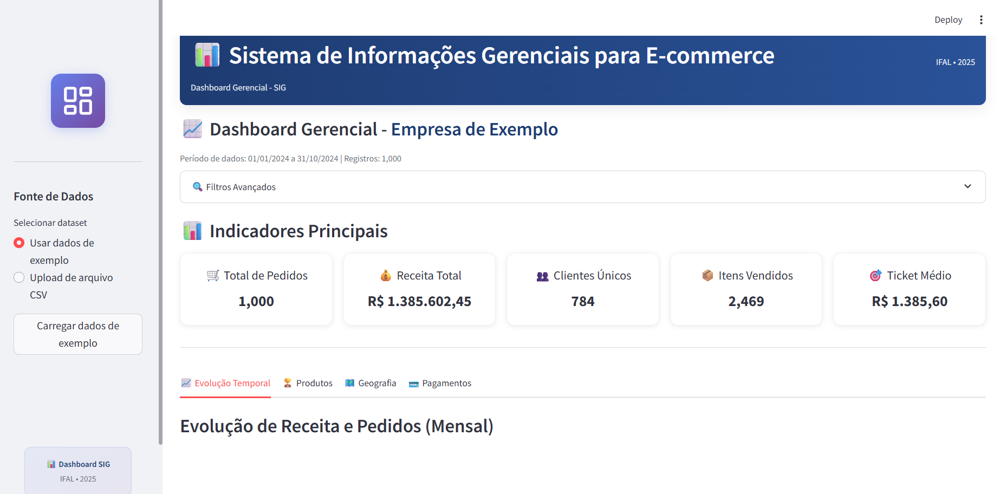

# 📊 Sistema de Informações Gerenciais para E-commerce

### *Dashboard Interativo em Python + Streamlit (Projeto Final SIGE – IFAL)*

[](https://www.python.org/downloads/)
[](https://streamlit.io/)
[](https://pandas.pydata.org/)
[](https://plotly.com/python/)
[](https://www2.ifal.edu.br/)

> Dashboard analítico desenvolvido para transformar dados brutos de e-commerce em **informações estratégicas**, com KPIs dinâmicos, gráficos interativos e design profissional empresarial.



---

# Sobre o Projeto

Este sistema foi desenvolvido como **projeto final da disciplina Sistemas de Informações Gerenciais (SIGE)** do **Instituto Federal de Alagoas (IFAL)**, sob orientação da **Professora Wládia Bessa**.

O objetivo é demonstrar, na prática, como um **SIG** coleta, processa, armazena e apresenta informações para **apoio à tomada de decisão**, através de um dashboard totalmente funcional.

Ele permite:

* Analisar pedidos, vendas, clientes e categorias
* Observar tendências temporais
* Filtrar dados por estado e intervalo de datas
* Gerar insights automaticamente
* Visualizar KPIs com design empresarial moderno

---

# Autoras

* **Ingrid Mônica da Silva Bezerra**
* **Karla Cristina de Sousa Araújo**

**Instituição:** IFAL – Instituto Federal de Alagoas
**Semestre:** 2025.1
**Disciplina:** Sistemas de Informações Gerenciais

---

# Funcionalidades

## KPIs (Indicadores Principais)

O dashboard exibe automaticamente:

* **🛒 Total de Pedidos**
* **💰 Receita Total**
* **👥 Clientes Únicos**
* **📦 Itens Vendidos**
* **🎯 Ticket Médio**

## Visualizações Interativas (Plotly)

* Gráfico de **volume de pedidos por mês**
* Gráfico de **receita total mensal**
* **Top 5 Categorias** por volume e receita
* Distribuição de **métodos de pagamento**
* Mapa por estado (UF) com resumo de vendas

## Dados e Filtros

* Filtro por **intervalo de datas**
* Filtro por **estado (UF)**
* Campo para inserir o **nome da empresa**
* Upload de CSV com correção automática de encoding

## Interface

* Tema **claro e escuro**
* Cards modernos em grid **2x2**
* Texto sempre legível (corrigido via CSS com tratamento automático)
* Layout responsivo para desktop e mobile

---

# Insights Automáticos

O sistema identifica padrões relevantes, como:

* Crescimento ou queda no volume de vendas
* Categorias de maior impacto
* Métodos de pagamento mais usados
* Estados com maior concentração de clientes
* Sazonalidade e comportamento das compras

---

# Tecnologias Utilizadas

| Tecnologia    | Versão | Utilização               |
| ------------- | ------ | ------------------------ |
| **Python**    | 3.10   | Backend do dashboard     |
| **Streamlit** | 1.41.1 | Interface e visualização |
| **Pandas**    | 2.2.3  | Processamento de dados   |
| **NumPy**     | 1.25.2 | Cálculos numéricos       |
| **Plotly**    | 5.15.0 | Gráficos interativos     |

---

# Instalação

## 1️⃣ Clonar o Repositório

```bash
git clone https://github.com/seu-usuario/sig-ecommerce-dashboard.git
cd sig-ecommerce-dashboard
```

## 2️⃣ Criar Ambiente Virtual

```bash
python -m venv venv
venv\Scripts\activate         # Windows
```

## 3️⃣ Instalar Dependências

```bash
pip install -r requirements.txt
```

---

# ▶️ Como Executar

```bash
streamlit run app.py
```

O dashboard abrirá automaticamente em:

```
http://localhost:8501
```

---

# Estrutura de Dados (CSV)

## Colunas Obrigatórias

| Coluna           | Tipo   | Descrição           |
| ---------------- | ------ | ------------------- |
| order_id         | String | ID único do pedido  |
| customer_id      | String | ID do cliente       |
| order_date       | Date   | Data do pedido      |
| product_category | String | Categoria           |
| product_price    | Float  | Preço unitário      |
| quantity         | Int    | Quantidade          |
| total_value      | Float  | Valor total         |
| customer_state   | String | Estado              |
| customer_city    | String | Cidade              |
| payment_method   | String | Método de pagamento |

### Separadores aceitos

`,  ;  |  \t  (tab)`

### Encodings aceitos

UTF-8, Latin1, ISO-8859-1, Windows-1252

---

# Estrutura do Projeto

```
sig-ecommerce-dashboard/
│
├── app.py
├── README.md
├── requirements.txt
│
└── assets/
│   └── dashboard.png
```

---

# 📚 Fundamentação Teórica – SIG

Um **Sistema de Informações Gerenciais (SIG)** transforma dados brutos em informações úteis para apoio gerencial.

### Etapas aplicadas neste projeto

1. **Coleta** – Upload de CSV
2. **Processamento** – Pandas limpa e valida
3. **Armazenamento** – DataFrame estruturado
4. **Distribuição** – Dashboard Streamlit
5. **Decisão** – KPIs e insights acionáveis

---

# 📄 Licença

Este projeto está sob licença **MIT**.

---


<div align="center">

 Desenvolvido para o Projeto Final SIGE – IFAL 2025.1  <br>
**Sistema de Informações Gerenciais para E-commerce**

</div>

